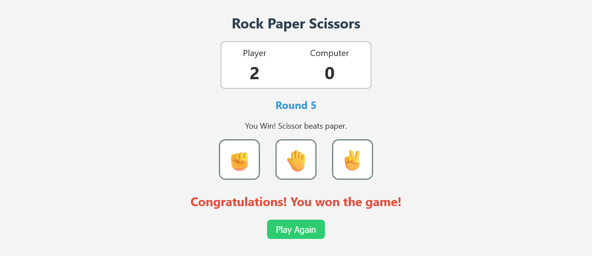

# Rock Paper Scissors

A classic implementation of the Rock, Paper, Scissors game built with HTML, CSS, and JavaScript. This project is part of The Odin Project's foundations course, focusing on DOM manipulation and event handling.

## Live Demo

You can play the game live here: **[Live Demo Link](https://adibadnan.github.io/Rock-Paper-Scissors/)**





## Features

- Play Rock, Paper, or Scissors against a computer opponent.
- The first player to score 5 points wins the game.
- A clean and simple user interface.
- Running score tracker for both the player and the computer.
- Clear win/loss/tie messages for each round.
- A "Play Again" button to restart the game after a winner is declared.

## Technologies Used

- **HTML5:** For the basic structure of the game.
- **CSS3:** For styling the user interface.
- **JavaScript (ES6+):** For the game logic, DOM manipulation, and event handling.

## How to Run Locally

To run this project on your local machine:

1.  Clone the repository (replace `your-username` with your GitHub username):
    ```bash
    git clone https://github.com/AdibAdnan/Rock-Paper-Scissors.git
    ```
2.  Navigate to the project directory:
    ```bash
    cd Rock-Paper-Scissors
    ```
3.  Open the `index.html` file in your web browser.

## Author

 **Adib Adnan Hoque**
